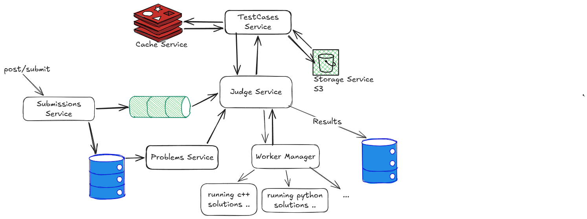

# JudgeIt

JudgeIt is a scalable, backend-focused online judge platform designed to securely compile, execute, and evaluate user-submitted source code against predefined test cases. It aims to provide reliable automated code evaluation similar to competitive programming platforms.

## System Design

## Core Components

* **API Server (NestJS)**
  * Manages user authentication, problem datasets, and HTTP API endpoints.
  * Ingests incoming code submissions and securely publishes them to the message broker.
* **Database & Caching (PostgreSQL & Redis)**
  * **PostgreSQL (via Prisma)** serves as the primary relational database for users, problems, and historical submission records.
  * **Redis** is utilized for fast caching of frequently accessed problems to minimize storage latency.
  * **S3** for storing test cases files and problems assets if found and user profile pictures.
* **Message Queue (Kafka)**
  * Acts as a highly-available, durable queue holding pending code submissions.
  * **Decoupling & Resilience:** Decouples the web-facing API from the execution workers and ensures no submissions are lost, even if a worker crashes, by requiring manual offset commits upon successful job completion.
  * **Backpressure Management:** Interacts with the worker manager to pause consumption if maximum concurrency is reached, preventing system overload.
* **Execution Worker (Worker Manager)**
  * Consumes unjudged code submissions and safely tracks offsets for fault tolerance.
  * Implements a **Semaphore-based Concurrency mechanism** to limit parallel executions per instance (default: 5 maximum concurrent tasks).
  * Runs untrusted user code safely inside isolated, resource-constrained sandbox environments and strictly validates stdout/stderr against expected test cases.
* **Judge Service**
  * Orchestrates the complete evaluation lifecycle for individual submissions passed from the workers.
  * Fetches problem resource limits (time, memory) and standard test cases, then triggers the sandbox execution.
  * Analyzes compilation outputs, normalizes expected vs. actual stdout, determines accurate verdicts (e.g., ACC, WA), and commits the metrics to the database.

## Future Work

* [ ] **Contests:** Support for setting up timed programming competitions with dedicated problem sets.
* [ ] **Realtime Leaderboard:** A live, dynamic ranking system based on user success rates and contest scores.
* [ ] **Submission Progress Notification:** Real-time updates pushed to the client (e.g., via WebSockets or Server-Sent Events) as their submission securely moves through queueing, processing, and evaluation states.